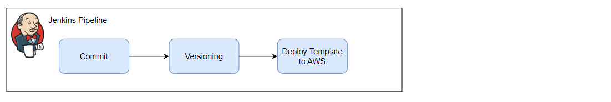

# stress-tracking-api

Users can use the mobile/web app to upload their stress level (0-5) and image (optional). The mobile/web app uses REST
API to upload it. Every uploaded images should be resized for more suitable to display on mobile/web. The mobile/web app
also has a feed that shows all stress level tracked by the user with associated image.

**Task**: Build the API described above. Write unit/e2e tests for each components.

# 1. Infrastructure

## AWS Diagrams

## Jenkins Server

`On-premise or Virtural machine on Cloud`

## Database Diagram
`
  User 
`

| Parameter | Type     | Description        |
|:----------|:---------|:-------------------|
| `userID`  | `string` | User ID            |
| `email`   | `string` | Stress level (0-5) |

`
Tracking
`

| Parameter     | Type       | Description                                 |
|:--------------|:-----------|:--------------------------------------------|
| `iD`          | `string`   | Stress Tracking Action ID - Auto Increments |
| `userID`      | `string`   | User ID                                     |
| `level`       | `number`   | Stress level (0-5)                          |
| `imageBucket` | `string`   | Image S3 Bucket Name                        |
| `imagePath`   | `string`   | Image S3 Bucket Path                        |
| `createdAt`   | `datetime` | Time created action                         |
# 2. Development

## API Endpoint

#### Upload a stress level record

`
  POST /tracking
`

| Parameter | Type     | Description        | Required |
|:----------|:---------|:-------------------|:---------|
| `userID`  | `string` | User ID            | Yes      |
| `level`   | `number` | Stress level (0-5) | Yes      |
| `image`   | `File`   | Stress image       | Yes      |

#### Get all stress level records

`
  GET /tracking
`

| Parameter   | Type        | Description | Required |
|:------------|:------------|:------------|:---------|
| `userID`    | `string`    | User ID     | No       |

## Repository Folder Structure

### Infrastructure Repo

| Name                         | Description                                                    |
|------------------------------|----------------------------------------------------------------|
| jenkinsFile                  | Jenkins definition for CI/CD stages                            |
| properties/                  | Includes properties configuration for infrastructure resources |
| properties/dev_params.json   | dev environment infrastructure  properties                     |
| properties/uat_params.json   | uat environment  infrastructure properties                     |
| properties/prod_params.json  | prod environment infrastructure  properties                    |
| CloudFormation/              | CloudFormation IaC folder                                      |
| CloudFormation/vpc.yaml      | VPC CFT template for Tracking API                              |
| CloudFormation/s3.yaml       | S3 CFT template for Tracking API                               |
| CloudFormation/database.yaml | Database CFT template for Tracking API                         |

### API Stress Tracking Repo

| Name                               | Description                                                                                                                                           |
|------------------------------------|-------------------------------------------------------------------------------------------------------------------------------------------------------|
| controllers/                       | `controller` class handles incoming requests and sends the response data back to the client. Use the `repository` class to interact with the database |
| controllers/tracking.controller.ts | `tracking` controller                                                                                                                                 |
| models/                            | Includes model represents the database model for its component                                                                                        |
| models/tracking.model.ts           | `tracking` model                                                                                                                                      |
| models/user.model.ts               | `user` model                                                                                                                                          |
| repositories/                      | Includes repositories wrapper for the database - Read and write data to the database.                                                                 |
| repositories/tracking.repo.ts      | `tracking` repository                                                                                                                                 |
| repositories/user.repo.ts          | `user` repository                                                                                                                                     |
| config/                            | Includes configuration files: global variables, logger config                                                                                         | 
| routes/                            | Register all component and middleware routes.                                                                                                         |
| routes/tracking.routes.ts          | API endpoints for stress tracking (GET /tracking, POST /tracking).                                                                                    |
| server.ts                          | Declare everything required for express server: import component route, error handling, ...                                                           |
| app.ts                             | Register all component and middleware routes.                                                                                                         |
| package.json                       | npm package metadata                                                                                                                                  |
| tests/                             | Test folder                                                                                                                                           | 
| tests/tracking.test.ts             | Test file for testing `tracking` component and its endpoints                                                                                          | 
| DockerFile                         | Dockerfile                                                                                                                                            |
| jenkinsFile                        | Jenkins definition for CI/CD stages                                                                                                                   |
| CloudFormation/                    | CloudFormation IaC folder                                                                                                                             |
| CloudFormation/service.yaml        | Service CFT template for Tracking API (Elastic Beanstalk, Role, Instance Profile, CloudWatch, ...)                                                    |
| properties/                        | Includes properties configuration for infrastructure resources                                                                                        |
| properties/dev_params.json         | dev environment infrastructure  properties                                                                                                            |
| properties/uat_params.json         | uat environment  infrastructure properties                                                                                                            |
| properties/prod_params.json        | prod environment infrastructure  properties                                                                                                           |

## 3. Deployment process

### Jenkins pipeline for Prerequisite resources

### Jenkins pipeline for Dockerfile
